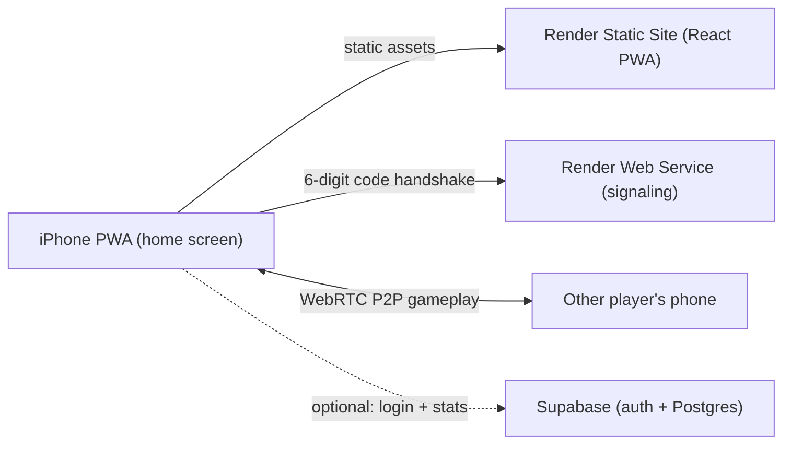

# Games PWA Foundation

A multi-game, installable web app optimized for iPhone home-screen use, designed so we can add dozens or hundreds of games cleanly. Single-player games run fully client-side (zero backend cost); multiplayer uses WebRTC peer-to-peer so the backend stays nearly idle.

## Cost summary (the priority)

- Frontend (React PWA) -> Render Static Site: free, on a CDN, never sleeps, 100 GB/mo bandwidth.
- Multiplayer -> WebRTC P2P. Players connect directly; the server only brokers the initial handshake, so almost no compute is used. Hosted on a free Render Web Service.
- Signaling server free-tier tradeoff: a free Render Web Service sleeps after 15 min idle and takes ~1 min to cold-start. Practical impact: the first person to start a remote match after a quiet period waits up to ~60s for the room code to connect; afterwards the actual gameplay is peer-to-peer and instant. Keeping it always-warm is ~$7/mo (optional, not recommended yet).
- Accounts/stats -> Supabase free tier: auth + 500 MB Postgres, 50k monthly active users. Pauses after 7 days of DB inactivity (avoided with a weekly GitHub Actions heartbeat ping). This is a later phase; v1 stores stats locally on-device.

### Things I'd flag as too expensive / risky right now

- Always-on backend or games that need constant server pings (real-time authoritative multiplayer): avoided entirely via P2P.
- "Unlimited NYT crossword / Wordle" and "LinkedIn Queens/Zip/Tango/Patches" specifically: those are trademarked products with copyrighted daily content. We will build original, generator-based games *inspired by* those mechanics (e.g. an unlimited word-guess game, an unlimited queens/latin-square puzzle) under our own names. Auto-generating good crosswords is genuinely hard, so crossword is parked as a stretch goal.

## Architecture



## Repository layout

```
/web                      # React + Vite + TS PWA  (Render Static Site)
  public/
    manifest.webmanifest
    icons/                # apple-touch-icon + PWA icons
  src/
    games/
      registry.ts         # central list of all games (the scaling backbone)
      types.ts            # GameDef, GameMode, GameProps
      tic-tac-toe/
        meta.ts           # metadata + lazy import
        TicTacToe.tsx     # the game component
      snake/ ...          # one folder per game
    components/
      MenuGrid.tsx        # the home menu (grid of icons)
      GameCard.tsx        # one icon + name tile
      GameShell.tsx       # wraps a game: back button, mode picker
      ModePicker.tsx      # Single / vs AI / Pass-and-play / Remote
    lib/
      multiplayer/        # WebRTC client + room-code logic
      stats/              # local on-device stats (localStorage); supabase later
    routes/               # /  and  /play/:gameId
    App.tsx
    main.tsx
  vite.config.ts          # vite-plugin-pwa for service worker + manifest
/server                   # tiny Node + ws signaling server (Render Web Service)
  src/index.ts
README.md                 # the living game list + roadmap (built from this plan)
render.yaml               # one-click Render blueprint (static site + web service)
```

## The scaling backbone: game registry

Every game is a self-contained folder that exports one metadata object. The home menu and router are generated automatically from the registry, so adding a game = add a folder + one registry line. Games are lazy-loaded (code-split) so 100+ games don't bloat the initial load.

```ts
// web/src/games/types.ts
export type GameMode = 'single' | 'ai' | 'pass-and-play' | 'remote';
export type GameCategory = 'word' | 'logic' | 'board-2p' | 'arcade' | 'card';

export interface GameDef {
  id: string;            // url-safe, e.g. 'tic-tac-toe'
  name: string;
  description: string;
  icon: string;          // emoji or /icons path
  category: GameCategory;
  modes: GameMode[];
  status: 'live' | 'wip';
  load: () => Promise<{ default: React.ComponentType<GameProps> }>;
}
```

```ts
// web/src/games/registry.ts
import { ticTacToe } from './tic-tac-toe/meta';
import { snake } from './snake/meta';
export const GAMES: GameDef[] = [ticTacToe, snake /* ... */];
```

## Multiplayer design (free, P2P, 6-digit codes)

- Shared `MultiplayerSession` abstraction with a simple `send(msg)` / `onMessage` interface so each game is multiplayer-agnostic.
- Host clicks "Remote play" -> generates a 6-digit code -> registers it with the signaling server -> waits.
- Guest enters the code -> signaling server relays WebRTC offer/answer/ICE between the two -> a direct P2P data channel opens -> gameplay messages flow phone-to-phone, server no longer involved.
- Same `MultiplayerSession` interface backs `pass-and-play` (local) and `ai` (local opponent), so a game implements its logic once and supports all modes.

## PWA / Apple optimization

- `vite-plugin-pwa` generates the service worker (offline caching of the app shell + single-player games) and manifest.
- iOS home-screen polish: `apple-touch-icon`, `apple-mobile-web-app-capable`, `apple-mobile-web-app-status-bar-style`, `theme-color`, `viewport-fit=cover` for safe areas, standalone display mode, splash handling.
- Touch-first UI: large tap targets, no hover dependence, responsive grid menu.

## Accounts & stats (later phase)

- v1: per-device stats (wins/losses, streaks, playtime) in `localStorage` via the `lib/stats` module - zero cost, no login.
- Phase 2: Supabase email/OAuth login; same `stats` interface swaps localStorage for Supabase so games don't change. Weekly GitHub Actions cron pings the DB to prevent the 7-day pause.

## Game roadmap (also written into README.md as a checklist)

Categories and an initial backlog. We'll implement a few at a time; the first build ships 2-3 to prove the foundation.

- Word & letter (single/daily-style, original generators):
  - Word guess (unlimited Wordle-style)
  - Hangman
  - Word Ladder (1v1 + solo)
  - Anagram / word-find
  - Crossword generator (stretch goal - hard)
- Logic & grid puzzles (LinkedIn-inspired, original):
  - Queens / one-per-row-col-region puzzle
  - Path-connect puzzle (Zip-style)
  - Balance/adjacency puzzle (Tango-style)
  - Region puzzle (Patches-style)
  - Sudoku, Nonograms, Minesweeper, 2048
- Classic 2-player board (single AI / pass-and-play / remote):
  - Tic Tac Toe
  - Ultimate Tic Tac Toe
  - Battleship
  - Connect Four
  - Dots and Boxes
  - Checkers, Reversi/Othello, Gomoku
  - Chess (later)
- Arcade / action (single-player, some 2p):
  - Snake
  - Tetris
  - Space Invaders
  - Breakout, Pong (2p), Asteroids, Flappy-style
- Card & casual:
  - Solitaire (Klondike)
  - Memory match
  - Blackjack

## First milestone (what this plan's todos build)

1. Scaffold the Vite React TS PWA + game registry + menu + routing.
2. Build `GameShell` + `ModePicker` and the `MultiplayerSession` abstraction (single / AI / pass-and-play stubbed; remote next).
3. Ship Tic Tac Toe and Snake to validate the foundation end-to-end.
4. Build the signaling server + WebRTC client; wire up remote 6-digit-code play on Tic Tac Toe.
5. Add `render.yaml`, PWA manifest/icons, and deploy docs to Render.
6. Write README with the full game list + roadmap checklist.

Accounts/Supabase are deferred to a later phase (local stats in v1).